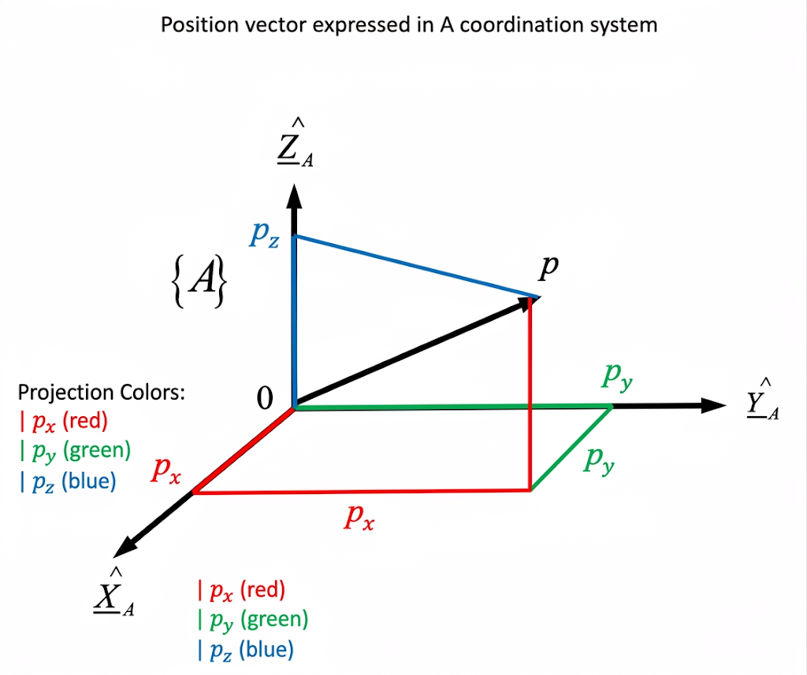
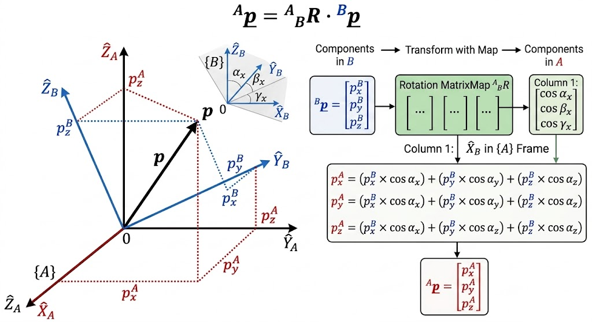

# Position and Rotation

공간상의 점이나 강체(Rigid Body)의 상태를 명확히 정의하기 위해서는 반드시 **기준 좌표계(Reference Coordinate System)**가 필요하며, 이를 기반으로 벡터를 사용하여 위치와 방향을 표현합니다.

## Position Vector (위치 벡터)

좌표계 $\{A\}$에서 표현된 임의의 위치 벡터를 ${^A\underline{p}}$라고 정의해 보겠습니다.

어떤 점의 위치는 해당 좌표계의 각 축을 따라 측정된 거리의 조합으로 나타낼 수 있습니다. 이 거리는 곧 **위치 벡터를 대응하는 각 좌표축(단위 벡터)에 투영(Projection)했을 때의 길이**를 의미합니다.

이를 수학적으로 표현하면, 위치 벡터 ${^A\underline{p}}$는 다음과 같이 각 축의 단위 벡터 $\hat{\underline{X}}_A, \hat{\underline{Y}}_A, \hat{\underline{Z}}_A$와의 투영(Projection)으로 나타낼 수 있습니다.

$$^{A}\underline{p} = \begin{bmatrix} p_x \\ p_y \\ p_z \end{bmatrix} = {^A\underline{p}} \cdot \hat{\underline{X}}_A + {^A\underline{p}} \cdot \hat{\underline{Y}}_A + {^A\underline{p}} \cdot \hat{\underline{Z}}_A$$

여기서 괄호 안의 내적($\cdot$) 연산은 벡터에서 특정 축 방향의 스칼라 성분만 추출하는 역할을 합니다. 각 축에 대한 내적 전개식은 다음과 같습니다.

$${^A\underline{p}} \cdot \hat{\underline{X}}_A = \begin{bmatrix} p_x \\ p_y \\ p_z \end{bmatrix} \cdot \begin{bmatrix} 1 \\ 0 \\ 0 \end{bmatrix} = (p_x \times 1) + (p_y \times 0) + (p_z \times 0) = p_x$$

$${^A\underline{p}} \cdot \hat{\underline{Y}}_A = \begin{bmatrix} p_x \\ p_y \\ p_z \end{bmatrix} \cdot \begin{bmatrix} 0 \\ 1 \\ 0 \end{bmatrix} = (p_x \times 0) + (p_y \times 1) + (p_z \times 0) = p_y$$

$${^A\underline{p}} \cdot \hat{\underline{Z}}_A = \begin{bmatrix} p_x \\ p_y \\ p_z \end{bmatrix} \cdot \begin{bmatrix} 0 \\ 0 \\ 1 \end{bmatrix} = (p_x \times 0) + (p_y \times 0) + (p_z \times 1) = p_z$$

결과적으로 각 축에 투영된 길이는 벡터의 각 스칼라 성분값과 정확히 일치합니다. 이 세 가지 투영 과정을 행렬 연산으로 한 번에 표현하면, 다음과 같이 단위 행렬(Identity Matrix)과의 곱 형태로 정리됩니다.

$$\begin{bmatrix} {^A\underline{p}} \cdot \hat{\underline{X}}_A \\ {^A\underline{p}} \cdot \hat{\underline{Y}}_A \\ {^A\underline{p}} \cdot \hat{\underline{Z}}_A \end{bmatrix} = \begin{bmatrix} 1 & 0 & 0 \\ 0 & 1 & 0 \\ 0 & 0 & 1 \end{bmatrix} \begin{bmatrix} p_x \\ p_y \\ p_z \end{bmatrix} = \begin{bmatrix} p_x \\ p_y \\ p_z \end{bmatrix}$$

## Rotation Matrix (회전 행렬)

위치가 '점'을 나타낸다면, 회전은 대상의 **방향(Orientation)**을 나타냅니다.

"원 좌표계를 기준으로 얼마만큼 회전했는가?"라는 것은, **새로운 좌표계 $\{B\}$의 각 축을 기준 좌표계 $\{A\}$의 축들에 투영하여 얻어낸 성분들**로 볼 수 있습니다.

즉, $\{B\}$ 좌표계의 단위 벡터($\hat{\underline{X}}_B$)를 $\{A\}$ 좌표계의 각 축($\hat{\underline{X}}_A, \hat{\underline{Y}}_A, \hat{\underline{Z}}_A$)과 내적(투영)한 값들이 모여 회전 행렬의 한 열(Column)을 구성합니다.

$\{A\}$ 좌표계 입장에서 본 $\hat{\underline{X}}_B$ 벡터는 다음과 같이 세 개의 방향 코사인(Direction Cosine) 성분으로 분해됩니다.

- **$x$ 성분:** $\hat{\underline{X}}_B$를 $\hat{\underline{X}}_A$에 투영한 값 $\rightarrow \hat{\underline{X}}_B \cdot \hat{\underline{X}}_A = \cos \alpha_x$
- **$y$ 성분:** $\hat{\underline{X}}_B$를 $\hat{\underline{Y}}_A$에 투영한 값 $\rightarrow \hat{\underline{X}}_B \cdot \hat{\underline{Y}}_A = \cos \beta_x$
- **$z$ 성분:** $\hat{\underline{X}}_B$를 $\hat{\underline{Z}}_A$에 투영한 값 $\rightarrow \hat{\underline{X}}_B \cdot \hat{\underline{Z}}_A = \cos \gamma_x$

이를 기하학적인 각도 단위로 표현하여 회전 행렬 $^A_BR$을 구성하면 다음과 같습니다.

$$^A_BR = \begin{bmatrix} \color{red}{\cos \alpha_x} & \cos \alpha_y & \cos \alpha_z \\ \color{red}{\cos \beta_x} & \cos \beta_y & \cos \beta_z \\ \color{red}{\cos \gamma_x} & \cos \gamma_y & \cos \gamma_z \end{bmatrix}$$

여기서 **첫 번째 열(빨간색 부분)** 자체가 곧 **"$\{A\}$ 좌표계 시스템 안에서 표현된 $\hat{\underline{X}}_B$ 벡터 그 자체"**를 의미합니다.

동일한 행렬을 연산의 관점인 내적으로 표현하면 다음과 같이 정리됩니다.

$$^A_B R = \begin{bmatrix} \hat{\underline{X}}_B \cdot \hat{\underline{X}}_A & \hat{\underline{Y}}_B \cdot \hat{\underline{X}}_A & \hat{\underline{Z}}_B \cdot \hat{\underline{X}}_A \\ \hat{\underline{X}}_B \cdot \hat{\underline{Y}}_A & \hat{\underline{Y}}_B \cdot \hat{\underline{Y}}_A & \hat{\underline{Z}}_B \cdot \hat{\underline{Y}}_A \\ \hat{\underline{X}}_B \cdot \hat{\underline{Z}}_A & \hat{\underline{Y}}_B \cdot \hat{\underline{Z}}_A & \hat{\underline{Z}}_B \cdot \hat{\underline{Z}}_A \end{bmatrix} = \begin{bmatrix} ^A\hat{\underline{X}}_B & ^A\hat{\underline{Y}}_B & ^A\hat{\underline{Z}}_B \end{bmatrix}$$

---

### Coordinate Transformation (좌표 변환)

지금까지 도출한 회전 행렬은 다음과 같은 좌표 변환 수식의 핵심 기저가 됩니다.

$${^A\underline{p}} = {^A_BR} \cdot {^B\underline{p}}$$

이 식의 물리적 의미를 직관적으로 풀어서 생각해보면 다음과 같습니다.

> "$\{B\}$ 좌표계에서 $x$축 방향으로 이동한 거리는, $\{A\}$ 좌표계 입장에서 볼 때 ($\hat{\underline{X}}_B$의 투영 성분 $\times x$)만큼 이동한 것이고, $y$축 방향 이동 역시 ($\hat{\underline{Y}}_B$의 투영 성분 $\times y$)만큼 이동한 것의 합이다."

이러한 매핑 과정을 이미지로 나타내면 아래와 같습니다.

결론적으로, 위 수식은 **회전된 로컬 좌표계 $\{B\}$에서 정의된 점의 위치($^B\underline{p}$)를 회전 행렬($^A_BR$)을 통해 매핑하여, 글로벌 기준 좌표계 $\{A\}$에서의 위치($^A\underline{p}$)로 변환해 내는 과정**을 의미합니다.
